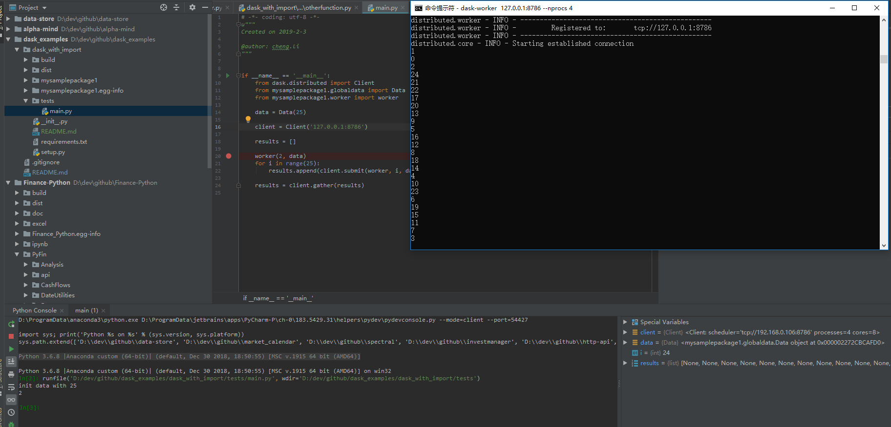

# Dask Example 1
----------------------

## 安装

在目录下运行:

```sh
$ python setup.py install
```

## 运行dask

```sh
$ dask-scheduler
$ dask-worker 127.0.0.1:8786 --nprocs 2
```

## 运行例子

```sh
$ python tests/main.py
```

## 输出结果

